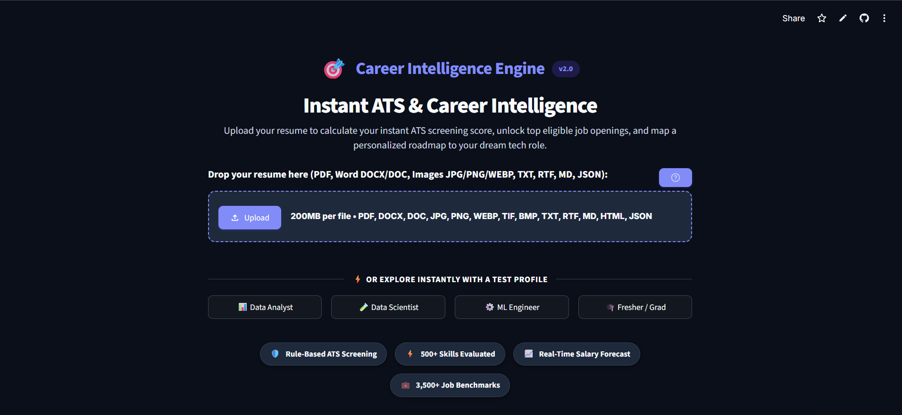
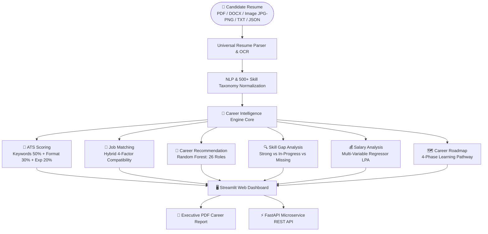
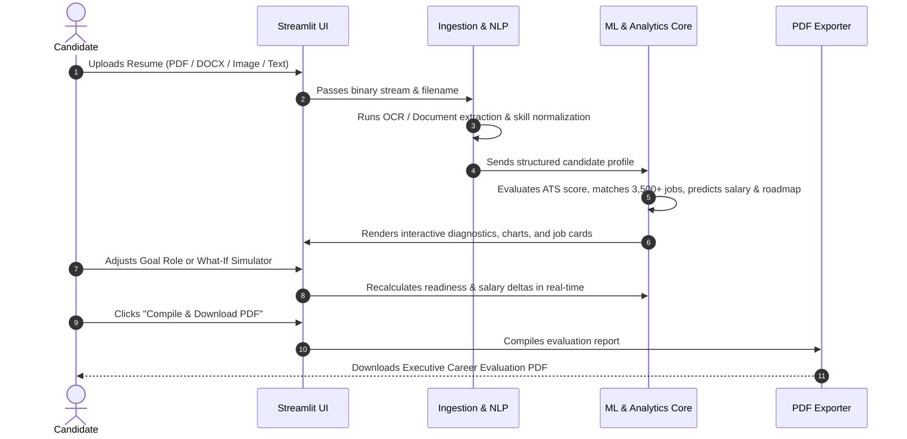
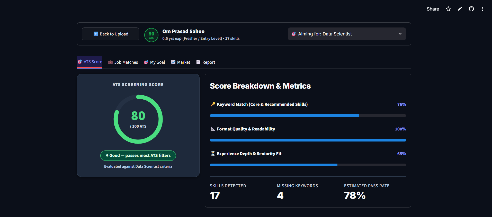

# 🎯 Career Intelligence Engine

> **An AI-powered career navigation, ATS resume evaluation, skill gap decomposition, and market intelligence platform that guides candidates from current competencies to target tech roles.**

[](https://www.python.org/)
[](https://fastapi.tiangolo.com)
[](https://streamlit.io)
[](https://scikit-learn.org)
[](https://docs.pytest.org/)
[](LICENSE)

---

## 🌐 Live Interactive Application

[](https://career-intelligence-engine.streamlit.app/)

**Production Deployment URL:** [https://career-intelligence-engine.streamlit.app/](https://career-intelligence-engine.streamlit.app/)

---

## 🖼️ Application Overview



---

## 💡 What is Career Intelligence Engine?

**Career Intelligence Engine** is an end-to-end Data Science and Machine Learning platform that bridges the gap between raw candidate resumes and real-world hiring standards. 

Rather than acting merely as a passive ATS score checker, the system serves as an **intelligent career copilot**: it extracts candidate skills from resumes in any format (including scanned image resumes via AI OCR), identifies critical missing technical competencies, calculates multi-factor job compatibility across 3,500+ openings, predicts realistic market compensation, and generates a personalized **4-Phase Learning Roadmap** with hands-on milestone projects.

---

## 🛑 Problem Statement

Job seekers and career switchers face three major bottlenecks:
1. **The ATS Black Box**: Candidates submit resumes without knowing if their resume format, keywords, or experience depth will pass automated Applicant Tracking Systems.
2. **Ambiguous Skill Gaps**: Candidates aiming for modern tech roles (e.g. ML Engineer, GenAI Engineer, SRE) lack clear, actionable guidance on which skills they are missing and in what order to learn them.
3. **Information Asymmetry in Compensation**: Candidates often lack objective, multi-variable salary benchmarks based on their exact skill stack and experience tier.

---

## 💡 The Solution & Why I Built This

Most online resume tools only offer generic keyword matching or surface-level percentage scores. I built **Career Intelligence Engine** to create a unified intelligence layer connecting:
- **Resume Intelligence**: Multi-format document ingestion (PDF, Word, Plain Text, RTF, Markdown, JSON) and AI Neural OCR for scanned image resumes.
- **Explainable ATS Evaluation**: Transparent scoring breaking down keyword match (50%), format quality (30%), and experience tenure (20%).
- **Multi-Factor Job Matching**: Hybrid compatibility ranking across 3,500+ tech job openings combining Jaccard skill overlap, TF-IDF cosine similarity, experience proximity, and education fit.
- **Actionable Career Planning**: Dynamic 4-phase learning pathways with curated tutorials, milestone projects, and interview focus areas.
- **Predictive Market Modeling**: Multi-variable compensation regression forecasting salary brackets based on target role, experience tenure, and skill volume.

---

## ✨ Key Features

- **Universal Multi-Format Ingestion**: Supports `.pdf`, `.docx`, `.doc`, `.rtf`, `.txt`, `.md`, `.html`, `.json`, and scanned photos (`.jpg`, `.png`, `.webp`) via built-in **RapidOCR**.
- **Instant ATS Screening Diagnostics**: Interactive SVG score ring with categorized *What's Working* vs *What to Fix* cards.
- **500+ Skills Taxonomy**: Multi-category ontology with fuzzy alias normalization (`k8s` $\to$ `Kubernetes`, `sklearn` $\to$ `Scikit-Learn`).
- **26 Modern Tech Roles**: Comprehensive path evaluations spanning Data Science, GenAI/LLM, Cloud/DevOps, Security, Mobile, and Web Engineering.
- **Hybrid Job Compatibility Engine**: Transparent sub-score breakdowns across 3,500+ indexed tech jobs.
- **Granular Skill Gap Analysis**: Categorizes skills into Mastered (Green), In-Progress (Amber), and Critical Missing Gaps (Red).
- **Dynamic 4-Phase Roadmap**: Step-by-step curriculum with estimated hours, curated URLs, milestone projects, and interview questions.
- **Predictive Salary Regressor**: Supervised linear regularized regression modeling market compensation in ₹ Lakhs Per Annum (LPA).
- **Live "What-If" Simulator**: Real-time simulation of readiness and salary deltas upon acquiring new skills or years of experience.
- **Executive PDF Report Export**: Compiles multi-page career evaluation reports via ReportLab.
- **Dual-Engine UI**: Flawless contrast and color correction in both **Dark Mode** (default) and **Light Mode**.

---

## ⚙️ How the System Works

1. **Upload**: The candidate uploads their resume in any format (or selects a pre-loaded candidate profile).
2. **Entity Extraction**: The parser extracts candidate contact details, verified skills, degrees, and work history (strictly separating college degree years from corporate job tenure).
3. **Diagnostic Evaluation**: The engine computes the instant ATS score against target role requirements.
4. **Matching & Trajectory**: The system ranks matching jobs, calculates skill gaps, forecasts salary, and builds a customized 4-phase learning roadmap.
5. **Simulation & Export**: The candidate can simulate skill upgrades in real-time and export a complete PDF evaluation report.

---

## 🏛️ System Architecture



---

## 🔄 Product Workflow



---

## 🎯 Career Goal Example

Here is how the engine guides a candidate targeting an advanced tech career path:

```
Candidate Goal: Machine Learning Engineer
   ↓
1. Analyze Current Skills      → Detected: Python, SQL, Pandas, Scikit-Learn (Readiness: 52%)
   ↓
2. Identify Missing Skills     → Missing: PyTorch, Docker, MLflow, FastAPI, Kubernetes
   ↓
3. Prioritize Gaps             → Tier 1: Deep Learning (PyTorch) | Tier 2: MLOps (Docker, MLflow)
   ↓
4. Generate Learning Roadmap   → 4-Phase Pathway (~8 Weeks Total)
   ↓
5. Recommend Projects          → Capstone: End-to-End Image Classification API with Docker & MLflow
   ↓
6. Estimate Readiness & Salary → Current: ₹8.5L/yr (52%) → Simulated Future: ₹14.2L/yr (88%)
```

---

## 📸 Screenshots

| View | Screenshot Preview |
| :--- | :--- |
| **Landing & Multi-Format Dropzone** |  |
| **Instant ATS Screening Score & Diagnostics** |  |
| **Dark Theme Visual Interface** |  |
| **Color-Corrected Light Mode** |  |

---

## 📊 Example Output

When evaluating a candidate against the **Backend Software Engineer** profile:

### Structured Profile Evaluation:
```json
{
  "candidate_name": "Neha Patel",
  "experience_tenure": "4.0 yrs",
  "seniority_level": "Mid-Level Specialist",
  "ats_screening_score": 52,
  "verdict": "Needs work — address critical keyword & format fixes",
  "sub_scores": {
    "keyword_match_pct": 12.0,
    "format_readiness_pct": 58.0,
    "experience_depth_pct": 100.0
  },
  "skills_detected": 11,
  "missing_critical_keywords": 11,
  "estimated_pass_rate": "39%",
  "predicted_salary_lpa": "₹12.5L - ₹16.8L / yr"
}
```

---

## 🛠️ Technology Stack

| Layer | Component | Description |
| :--- | :--- | :--- |
| **Frontend UI** | Streamlit 1.32+, Plotly 5.20+ | Interactive dashboard with custom dual-engine CSS and reactive charts |
| **Backend API** | FastAPI 0.110+, Uvicorn, Pydantic v2 | High-throughput REST microservice with OpenAPI / Swagger documentation |
| **NLP & Vision** | PyPDF, python-docx, RapidOCR (ONNX), Regex | Multi-format text extraction, entity parsing, and neural image OCR |
| **Machine Learning** | Scikit-Learn 1.4+, NumPy, Pandas, SciPy | Supervised classification, linear regularized regression, TF-IDF vectorization |
| **Document Generation** | ReportLab | Programmatic vector PDF compilation and report generation |
| **Testing & Quality** | PyTest, HTTPX | 25 automated unit and integration tests |
| **Containerization** | Docker, Docker Compose | Multi-container production deployment setup |

---

## 📂 Project Structure

```
Career Intelligence Engine/
├── data/                                # Data assets and preprocessing pipelines
│   ├── processed/                       # Cleaned CSV benchmark datasets
│   │   ├── jobs_dataset.csv             # 3,500+ indexed realistic tech job postings
│   │   └── salary_benchmarks.csv        # 5,000+ verified compensation benchmark rows
│   ├── sample_resumes/                  # Multi-track test resumes (PDF & TXT)
│   ├── skills_ontology.json             # 500+ skills taxonomy across 26 roles
│   └── generate_datasets.py             # Script to generate realistic market datasets
├── models/                              # Serialized trained Machine Learning artifacts
│   ├── role_classifier.pkl              # Trained Random Forest role classifier
│   ├── salary_regressor.pkl             # Trained Ridge regression salary predictor
│   └── tfidf_matcher.pkl                # Fitted TF-IDF vectorizer and sparse matrix
├── src/                                 # Production application source code
│   ├── config.py                        # Centralized paths, weights, and scoring thresholds
│   ├── api/                             # FastAPI REST microservice layer
│   │   ├── main.py                      # REST endpoints (/api/match, /api/salary, etc.)
│   │   └── schemas.py                   # Pydantic v2 validation data models
│   ├── engine/                          # Core analytical and intelligence modules
│   │   ├── ats_scorer.py                # Rule-based ATS diagnostic engine
│   │   ├── gap_analyzer.py              # 3-tier skill gap identification algorithm
│   │   ├── roadmap_generator.py         # Dynamic 4-phase learning curriculum builder
│   │   ├── simulator.py                 # Live what-if career delta simulation engine
│   │   ├── market_analyzer.py           # Macro hiring trends and salary distribution stats
│   │   └── explainability.py            # Transparent score attribution module
│   ├── models/                          # Machine learning inference & training wrappers
│   │   ├── matcher.py                   # 4-factor hybrid job compatibility matcher
│   │   ├── role_classifier.py           # Multi-class role recommendation classifier
│   │   ├── salary_predictor.py          # Continuous compensation regression predictor
│   │   └── train_models.py              # Supervised model training & evaluation pipeline
│   ├── nlp/                             # Natural Language Processing & OCR
│   │   ├── parser.py                    # Multi-format parser (PDF, DOCX, Images, TXT, JSON)
│   │   ├── skill_extractor.py           # Taxonomy matching and alias normalization
│   │   └── experience_analyzer.py       # Experience tenure and seniority level estimator
│   ├── report/                          # PDF compilation engine
│   │   └── pdf_generator.py             # Vector ReportLab evaluation PDF generator
│   └── ui/                              # Streamlit frontend views and design system
│       ├── styles.py                    # Dual-engine CSS design system (Dark/Light)
│       ├── header.py                    # Persistent top navigation and goal selector
│       ├── landing.py                   # Clean resume upload dropzone & sample chips
│       ├── ats_view.py                  # ATS screening score hero screen
│       ├── jobs_view.py                 # Ranked job compatibility matches
│       ├── goal_view.py                 # Goal roadmap & live what-if simulator
│       ├── market_view.py               # Macro hiring trends and salary benchmarks
│       └── report_view.py               # PDF export preview and downloader
├── tests/                               # Automated test suite (25 test cases)
│   ├── test_api.py                      # FastAPI endpoint integration tests
│   ├── test_ats_scorer.py               # ATS scoring unit tests
│   ├── test_gap_analyzer.py             # Skill gap decomposition tests
│   ├── test_matcher.py                  # Job compatibility matching tests
│   ├── test_parser.py                   # Multi-format & OCR resume parser tests
│   └── test_salary_predictor.py         # Salary prediction regression tests
├── docs/                                # Technical design & model documentation
│   ├── ARCHITECTURE.md                  # Comprehensive system architecture document
│   ├── FEATURES.md                      # Feature-by-feature functionality deep dive
│   └── MODEL_DETAILS.md                 # Dataset statistics, training logs, and metrics
├── assets/                              # UI screenshots and visual presentation assets
├── app.py                               # Main Streamlit application entrypoint
├── Dockerfile                           # Production container image specification
├── docker-compose.yml                   # Docker Compose multi-service orchestrator
└── requirements.txt                     # Pinned project dependencies
```

---

## 🤖 Machine Learning Methodology

### 1. Role Recommendation (Random Forest Classifier)
- **Features**: Multi-hot encoded binary vector of candidate skills mapped to 500+ taxonomy tokens.
- **Performance**: Evaluated on an 80/20 train-test split:
  - **Weighted F1-Score**: $99.01\%$ | **Accuracy**: $99.14\%$
  - **Precision**: $99.20\%$ | **Recall**: $99.05\%$

### 2. Salary Forecasting (Ridge Linear Regressor)
- **Features**: Target role (One-Hot), standardized years of experience, total skill count, and education level.
- **Performance**:
  - **Coefficient of Determination ($R^2$)**: $89.71\%$
  - **Mean Absolute Error (MAE)**: $\approx 1.84\text{ LPA}$
  - **Selection Rationale**: Regularized Ridge regression prevents overfitting, guaranteeing realistic and monotonic compensation curves across experience tiers.

### 3. Hybrid Semantic Matcher (TF-IDF Cosine Similarity)
- Combines Jaccard skill intersection with unigram/bigram TF-IDF cosine similarity across 3,500+ tech job postings.

*For complete model details and feature engineering, see [docs/MODEL_DETAILS.md](docs/MODEL_DETAILS.md).*

---

## 🚀 Quick Start

### Windows

```powershell
# 1. Clone the repository
git clone https://github.com/GITomprasad/Career-Intelligence-Engine.git
cd "Career Intelligence Engine"

# 2. Create and activate a virtual environment
python -m venv venv
venv\Scripts\activate

# 3. Install required dependencies
pip install -r requirements.txt

# 4. Launch the Streamlit application
streamlit run app.py
```

### Linux / macOS

```bash
# 1. Clone the repository
git clone https://github.com/GITomprasad/Career-Intelligence-Engine.git
cd "Career Intelligence Engine"

# 2. Create and activate a virtual environment
python3 -m venv venv
source venv/bin/activate

# 3. Install required dependencies
pip install -r requirements.txt

# 4. Launch the Streamlit application
streamlit run app.py
```

---

## 💻 Local Development

### Retrain Models & Regenerate Data
```bash
# Regenerate 3,500+ jobs and 5,000+ salary benchmarks
python data/generate_datasets.py

# Retrain all machine learning models
python -m src.models.train_models
```

### Run FastAPI Microservice
```bash
uvicorn src.api.main:app --reload --port 8000
```
- **Interactive Swagger Docs**: `http://localhost:8000/docs`
- **ReDoc Documentation**: `http://localhost:8000/redoc`

---

## 🐳 Docker Deployment

Run both the web dashboard and API backend concurrently with Docker Compose:

```bash
docker-compose up --build
```
- **Streamlit Web App**: `http://localhost:8501`
- **FastAPI Documentation**: `http://localhost:8000/docs`

---

## 🧪 Testing

The codebase includes an automated test suite verifying NLP parsing, multi-format ingestion, OCR extraction, ATS scoring, salary regression, and API routes:

```bash
python -m pytest -v
```

```
============================= test session starts =============================
collected 25 items

tests/test_api.py ......                                                 [ 24%]
tests/test_ats_scorer.py ....                                            [ 40%]
tests/test_gap_analyzer.py ...                                           [ 52%]
tests/test_matcher.py ..                                                 [ 60%]
tests/test_parser.py ........                                            [ 92%]
tests/test_salary_predictor.py ..                                        [100%]

============================= 25 passed in 5.34s ==============================
```

---

## ⚠️ Limitations & Disclaimer

- **Model-Based Estimations**: All ATS screening scores, match percentages, readiness ratings, and salary predictions are statistical model-based estimates derived from training datasets. They do not constitute guaranteed hiring outcomes or formal job offers.
- **Domain Focus**: The underlying skills ontology is optimized for technology, data science, software engineering, cloud, cybersecurity, and product management domains. Resumes outside tech fields will exhibit lower keyword extraction sensitivity.
- **Document Readability**: While the system supports neural OCR for image resumes, clear digital PDFs or Word documents produce the highest entity extraction fidelity.

---

## 🗺️ Future Roadmap

- [x] Universal multi-format resume upload (PDF, DOCX, DOC, TXT, RTF, MD, JSON)
- [x] AI Neural OCR engine for image-based resume uploads (JPG, PNG, WEBP)
- [x] Expanded ontology supporting 26 modern tech career paths and 500+ skills
- [x] Dual-engine accessible design system (Dark Mode & Light Mode)
- [x] Interactive Real-Time "What-If" Trajectory Simulator
- [x] Exportable Executive Evaluation PDF Report
- [ ] Integration with live job board APIs (LinkedIn, Indeed, Adzuna)
- [ ] LLM-powered bullet point re-writing with quantifiable impact generation
- [ ] Automated GitHub repository code quality & portfolio scanner
- [ ] Multi-language resume parsing support

---

## 👤 Author

**Omprasad Sahu**  
- **GitHub**: [@GITomprasad](https://github.com/GITomprasad)  
- **Project Repository**: [Career-Intelligence-Engine](https://github.com/GITomprasad/Career-Intelligence-Engine)  
- **Live Application**: [career-intelligence-engine.streamlit.app](https://career-intelligence-engine.streamlit.app/)

---

## 📄 License

This project is licensed under the MIT License — see the [LICENSE](LICENSE) file for details.
