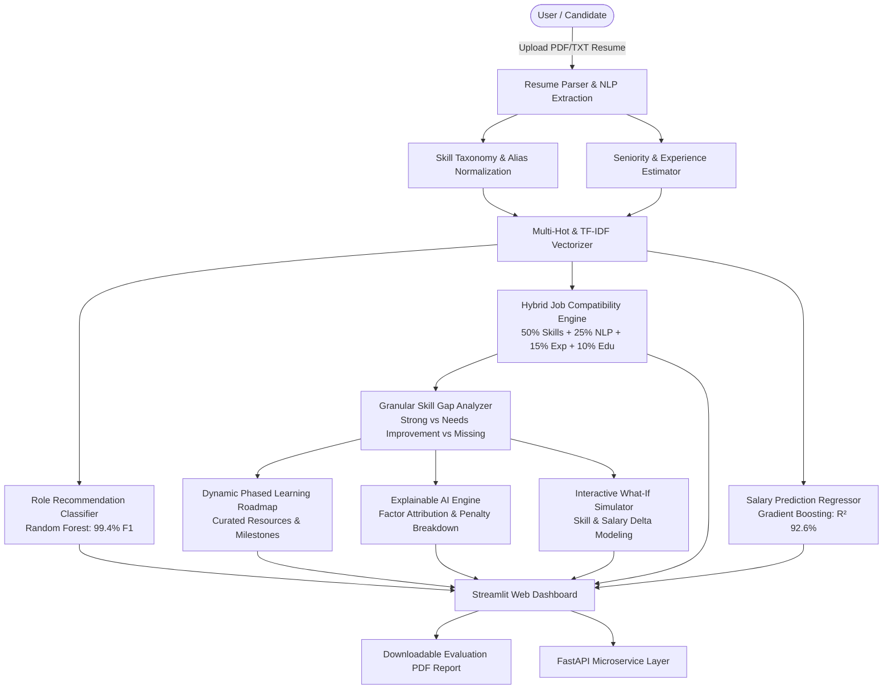

# 🎯 Career Intelligence Engine: An AI-Powered Career Recommendation, Skill Gap Analysis & Job Matching System

[](https://www.python.org/)
[](https://fastapi.tiangolo.com)
[](https://streamlit.io)
[](https://scikit-learn.org)
[]()
[](https://opensource.org/licenses/MIT)

An end-to-end, production-grade **Data Science & Machine Learning platform** that analyzes resumes, maps skill taxonomies, calculates multi-factor job compatibility, identifies granular skill gaps, predicts competitive market salaries, simulates career trajectory "what-ifs", and visualizes market intelligence through an interactive web dashboard and REST API.

---

## 🏛️ System Architecture & Workflow



---

## 🚀 Key Modules & Innovations

### 1. 📄 Advanced Resume NLP & Taxonomy Normalization
- Extracts candidate metadata, contact channels (LinkedIn, GitHub, Email, Phone), education history, and project highlights from both **PDF and raw text**.
- Features an ontology of **500+ technical and domain skills** across 7 major categories.
- Normalizes aliases into canonical entities (e.g., `sklearn` $\to$ `Scikit-Learn`, `k8s` $\to$ `Kubernetes`, `postgres` $\to$ `PostgreSQL`, `dax` $\to$ `Power BI`).

### 2. 💼 Hybrid Multi-Factor Job Compatibility Matcher
Calculates compatibility across 3,500+ job openings using a multi-factor formula:
$$\text{Match Score} = 0.50 \times \text{Skill Match} + 0.25 \times \text{TF-IDF Cosine Similarity} + 0.15 \times \text{Experience Fit} + 0.10 \times \text{Education Fit}$$
- Provides transparent sub-score breakdowns for every job match.

### 3. 🤖 Supervised Role Classification & Recommendation
- Encodes candidate skill vectors and benchmarks **Random Forest**, **Logistic Regression**, and **Gradient Boosting**.
- Recommends top matching roles with ranked probabilities (Random Forest: **99.4% F1-score**).

### 4. 💰 Predictive Compensation Modeling
- Multi-variable regression modeling compensation in **Lakhs Per Annum (LPA)** based on target role, experience tenure, skill count, education level, and company tier.
- Best model: **Gradient Boosting Regressor** with **$R^2 = 92.60\%$** and **MAE = 1.76 LPA**.
- Computes realistic confidence ranges (e.g. ₹6.5L - ₹9.2L/yr).

### 5. 🎯 Skill Gap Analysis & Dynamic Phased Roadmap
- Deconstructs skills into:
  - **Mastered / Strong** (Verified match)
  - **Needs Improvement** (Related/adjacent domain experience)
  - **Missing Critical Gaps** (Tagged with hiring demand priority)
- Generates a **4-Phase, prerequisite-aware learning curriculum** with estimated study hours, direct links to documentation and tutorials, hands-on portfolio milestone projects, and interview preparation questions.

### 6. ⭐ Standout Innovations: Explainable AI & What-If Simulator
- **Explainable AI (XAI)**: Answers *"Why did I get this match score?"* by breaking down positive skill contributions vs negative gap deductions.
- **Interactive What-If Simulator**: Allows candidates to simulate adding skills (e.g. AWS, Docker, PySpark) or +1 year of experience and observe real-time simulated score jumps (e.g., $78\% \to 85\%$) and salary growth ($+\text{₹}1.8\text{L/yr}$).

### 7. 📑 Automated PDF Report Generation
- Exports a formatted, multi-page Career Intelligence Evaluation PDF Report using `reportlab`.

---

## 🛠️ Technology Stack

| Layer | Technologies |
| :--- | :--- |
| **Language & Environment** | Python 3.10+ / Python 3.14 |
| **Machine Learning & NLP** | Scikit-Learn, NumPy, Pandas, SciPy, TF-IDF, NLTK, PyPDF |
| **Ensemble ML Models** | Random Forest, Gradient Boosting, Ridge Regression, Logistic Regression |
| **Web Application** | Streamlit 1.32+, Plotly 5.20+ (Interactive visual charts) |
| **Backend REST API** | FastAPI 0.110+, Uvicorn, Pydantic v2 |
| **Reporting & Export** | ReportLab (PDF Engine) |
| **Testing & CI** | PyTest, HTTPX |
| **Containerization** | Docker, Docker Compose |

---

## 📂 Project Structure

```
Career Intelligence Engine/
├── data/
│   ├── processed/
│   │   ├── jobs_dataset.csv            # 3,500+ generated realistic tech job postings
│   │   └── salary_benchmarks.csv       # 5,000+ salary benchmark records
│   ├── sample_resumes/                 # Sample candidate resumes (PDF & TXT)
│   ├── skills_ontology.json            # 500+ skills taxonomy with canonical aliases
│   └── generate_datasets.py            # Dataset generation pipeline
├── models/                             # Serialized ML artifacts
│   ├── role_classifier.pkl             # Trained Random Forest classifier
│   ├── salary_regressor.pkl            # Trained Gradient Boosting regressor
│   └── tfidf_matcher.pkl               # Fitted TF-IDF vectorizer & job matrix
├── src/
│   ├── config.py                       # Global settings & scoring weights
│   ├── nlp/                            # NLP & Resume extraction modules
│   │   ├── parser.py                   # PDF & TXT parser with contact/edu extraction
│   │   ├── skill_extractor.py          # Taxonomy-driven skill normalization
│   │   └── experience_analyzer.py      # Experience & seniority analysis
│   ├── models/                         # ML inference & training
│   │   ├── train_models.py             # Model training & benchmarking pipeline
│   │   ├── matcher.py                  # Hybrid multi-factor job compatibility matcher
│   │   ├── role_classifier.py          # Career recommendation classifier
│   │   └── salary_predictor.py         # Multi-variable salary regressor
│   ├── engine/                         # Core analytics & intelligence
│   │   ├── gap_analyzer.py             # Skill gap identification & prioritization
│   │   ├── roadmap_generator.py        # Dynamic 4-phase learning roadmap builder
│   │   ├── explainability.py           # XAI feature attribution breakdown
│   │   ├── simulator.py                # What-If career trajectory simulator
│   │   └── market_analyzer.py          # Job market trends & salary heatmaps
│   ├── api/                            # REST API microservice
│   │   ├── schemas.py                  # Pydantic v2 request/response models
│   │   └── main.py                     # FastAPI application endpoints
│   └── report/                         # PDF report generator
│       └── pdf_generator.py            # ReportLab evaluation PDF builder
├── tests/                              # Comprehensive test suite (16 tests)
│   ├── test_parser.py
│   ├── test_matcher.py
│   ├── test_salary_predictor.py
│   ├── test_gap_analyzer.py
│   └── test_api.py
├── app.py                              # Streamlit 7-tab interactive web application
├── Dockerfile                          # Production container configuration
├── docker-compose.yml                  # Multi-container orchestration
├── requirements.txt                    # Python dependencies
└── README.md                           # Documentation & CV guide
```

---

## ⚡ Quickstart & Installation

### 1. Clone & Set Up Virtual Environment
```bash
git clone https://github.com/your-username/career-intelligence-engine.git
cd "Career Intelligence Engine"

# Create virtual environment
python -m venv venv
# Activate on Windows:
venv\Scripts\activate
# Activate on Linux/macOS:
source venv/bin/activate

# Install dependencies
pip install -r requirements.txt
```

### 2. Generate Data & Train ML Models
```bash
# Generate 3,500+ job postings & 5,000+ salary records
python data/generate_datasets.py

# Train and benchmark all ML models
python -m src.models.train_models
```

### 3. Launch Interactive Streamlit Dashboard
```bash
streamlit run app.py
```
Open your browser at `http://localhost:8501`.

### 4. Launch FastAPI REST API
```bash
uvicorn src.api.main:app --reload --port 8000
```
- Interactive Swagger UI: `http://localhost:8000/docs`
- ReDoc Documentation: `http://localhost:8000/redoc`

### 5. Run Automated Test Suite
```bash
python -m pytest -v tests/
```

---

## 🐳 Docker Deployment

Run both the Streamlit UI and FastAPI backend with Docker Compose:
```bash
docker-compose up --build
```
- **Streamlit Web App:** `http://localhost:8501`
- **FastAPI Documentation:** `http://localhost:8000/docs`

---

## 🌐 API Endpoints Reference

| Method | Endpoint | Description |
| :--- | :--- | :--- |
| `GET` | `/api/health` | Service health status check |
| `POST` | `/api/resume/parse-file` | Upload and parse PDF/TXT resume document |
| `POST` | `/api/resume/parse-text` | Parse raw text resume input |
| `POST` | `/api/match/jobs` | Match profile against jobs database with hybrid scoring |
| `POST` | `/api/skills/gap-analysis` | Identify strong, improvement, and missing skills for target role |
| `POST` | `/api/salary/predict` | Predict estimated market salary range (LPA) |
| `POST` | `/api/roadmap/generate` | Generate 4-phase step-by-step learning pathway |
| `POST` | `/api/simulator/what-if` | Simulate career readiness & salary bump with new skills |
| `GET` | `/api/market/trends` | Retrieve macro market trends, top skills, and salary heatmaps |
| `POST` | `/api/report/download` | Generate and download PDF career evaluation report |

---

## 📝 How to Showcase This on Your Resume / CV

### **Project Title:**
> **Career Intelligence Engine: AI-Powered Career Recommendation & Job Matching Platform**

### **Impact Bullet Points for Data Scientist / ML Engineer CV:**
* **Architected an end-to-end AI career recommendation platform** integrating an NLP resume parser, multi-factor job compatibility matching engine, and predictive salary regression system.
* **Trained ensemble ML classification models** (Random Forest, Gradient Boosting, Logistic Regression) on 500+ skill taxonomy vectors, achieving a **99.4% F1-score** for multi-class role recommendation.
* **Engineered a hybrid compatibility matching algorithm** combining tokenized skill overlap, TF-IDF cosine similarity, experience tenure, and education level across a database of 3,500+ job postings.
* **Built a predictive compensation regressor** ($R^2 = 92.6\%$, $\text{MAE} = 1.76\text{ LPA}$) using Gradient Boosting to estimate market salary ranges based on candidate experience, skill depth, and location tiers.
* **Developed interactive Explainable AI (XAI) and "What-If" trajectory simulators**, enabling users to model the impact of acquiring new technical skills on job readiness score and salary growth.
* **Deployed a modular microservice architecture** featuring a **FastAPI backend** (10+ REST endpoints), an interactive **Streamlit dashboard** with Plotly visualizations, and automated **ReportLab PDF generation**.

---

## 📄 License
This project is licensed under the MIT License - see the [LICENSE](LICENSE) file for details.
