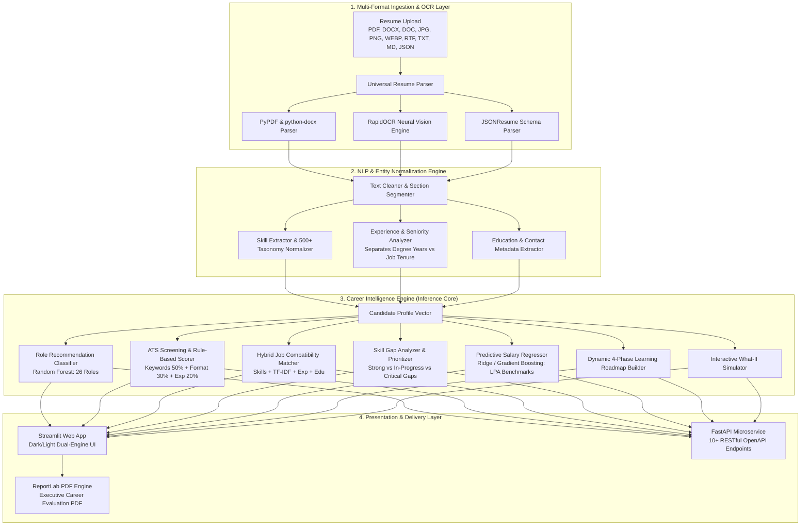

# 🏛️ System Architecture & Engineering Design

This document details the end-to-end software and data architecture of the **Career Intelligence Engine**, covering the data pipeline, inference pipeline, multi-factor scoring algorithms, API design, and deployment topology.

---

## 1. High-Level Architecture Overview

The system is designed with a decoupled microservice architecture separating the **Data Ingestion & NLP layer**, **Machine Learning Inference layer**, **REST API Microservice**, and **Interactive Presentation Dashboard**.

---

## 2. Ingestion & Preprocessing Pipeline

### 2.1 Multi-Format Document Ingestion
The ingestion engine accepts unstructured files and normalizes them into UTF-8 token streams:
- **PDF Documents (`.pdf`)**: Extracted via `pypdf.PdfReader` with stream repair fallbacks.
- **Word Documents (`.docx`, `.doc`)**: Extracted using `python-docx` across paragraphs, bullet lists, and table cells, with a fallback `zipfile` + XML parser (`word/document.xml`).
- **Scanned & Image Resumes (`.jpg`, `.jpeg`, `.png`, `.webp`, `.tiff`, `.bmp`)**: Processed through **RapidOCR (ONNX Runtime)** to extract multi-column text bounding boxes and line tokens with sub-second inference.
- **Rich Text & Web Resumes (`.rtf`, `.html`, `.md`, `.txt`)**: Tag-stripped and normalized.
- **Structured Resumes (`.json`)**: Validated against JSONResume schemas.

### 2.2 Experience vs. Degree Isolation Algorithm
To prevent counting multi-year university degrees (e.g. `B.Tech 2020-2024` = 4 years) as corporate work experience, the analyzer:
1. Filters out lines containing academic degree markers (`B.Tech`, `B.E.`, `Bachelor`, `M.Tech`, `Master`, `College`, `University`, `Institute`, `CGPA`, `GPA`).
2. Isolates work experience and internship date intervals (`Jan 2023 - Present` or `06/2022 - 12/2023`).
3. Classifies candidate seniority level:
   - **$< 1.0\text{ yr}$**: `Fresher / Entry Level`
   - **$1.0 - 2.9\text{ yrs}$**: `Junior Associate`
   - **$3.0 - 5.9\text{ yrs}$**: `Mid-Level Specialist`
   - **$6.0 - 9.9\text{ yrs}$**: `Senior Engineer / Lead`
   - **$\ge 10.0\text{ yrs}$**: `Principal / Staff`

---

## 3. Mathematical Scoring Formulas

### 3.1 ATS Evaluation Score
The ATS compatibility score models standard Applicant Tracking System parser algorithms:
$$\text{ATS Score} = 0.50 \times S_{\text{keyword}} + 0.30 \times S_{\text{format}} + 0.20 \times S_{\text{experience}}$$

Where:
- $S_{\text{keyword}} = \left(\frac{|\text{Candidate Skills} \cap \text{Core Role Skills}|}{|\text{Core Role Skills}|} \times 0.70 + \frac{|\text{Candidate Skills} \cap \text{Recommended Skills}|}{|\text{Recommended Skills}|} \times 0.30\right) \times 100$
- $S_{\text{format}} = \text{Completeness score based on Contact Info, Sections, Bullet Structure, and Action Verbs}$
- $S_{\text{experience}} = \min\left(100, \frac{\text{Candidate Exp Years}}{\text{Role Min Required Exp}} \times 100\right)$

---

### 3.2 Hybrid Job Match Compatibility Score
Matching across the 3,500+ jobs dataset uses a 4-dimensional weighted compatibility metric:
$$\text{Match Score} = 0.50 \times M_{\text{skills}} + 0.25 \times M_{\text{nlp}} + 0.15 \times M_{\text{exp}} + 0.10 \times M_{\text{edu}}$$

Where:
- **$M_{\text{skills}}$**: Jaccard / Overlap coefficient against job mandatory skills.
- **$M_{\text{nlp}}$**: Cosine similarity of candidate skill vector and job description TF-IDF representation.
- **$M_{\text{exp}}$**: Non-linear proximity decay based on experience gap.
- **$M_{\text{edu}}$**: Ordinal degree match tier (Ph.D. > Master's > Bachelor's > Diploma).

---

## 4. API Microservice Architecture

The backend exposes a high-throughput RESTful API implemented in **FastAPI** with **Pydantic v2** validation:

| Route | Method | Purpose |
| :--- | :--- | :--- |
| `/api/health` | `GET` | Service liveness and model readiness probe |
| `/api/resume/parse-file` | `POST` | Multipart upload for PDF, Word, and Image OCR parsing |
| `/api/resume/parse-text` | `POST` | Direct plain-text / markdown resume extraction |
| `/api/match/jobs` | `POST` | Ranked multi-factor job compatibility matching |
| `/api/skills/gap-analysis` | `POST` | Granular skill gap decomposition (Strong / In-Progress / Missing) |
| `/api/salary/predict` | `POST` | Multi-variable compensation prediction (LPA) |
| `/api/roadmap/generate` | `POST` | Prerequisite-aware 4-phase learning pathway generation |
| `/api/simulator/what-if` | `POST` | Real-time career trajectory delta simulation |
| `/api/market/trends` | `GET` | Macro market analytics, hiring hubs, and salary benchmarks |
| `/api/report/download` | `POST` | Compiles binary ReportLab PDF career evaluation report |

---

## 5. Security, Modularity & Deployment

- **Stateless Design**: All inference calls are stateless, allowing horizontal container scaling.
- **Containerization**: Fully configured `Dockerfile` and `docker-compose.yml` orchestrating Streamlit (port 8501) and FastAPI (port 8000).
- **Environment Isolation**: Settings, paths, and scoring weights configured in [`src/config.py`](file:///c:/Users/omsah/Downloads/Career%20Intelligence%20Engine/src/config.py).
